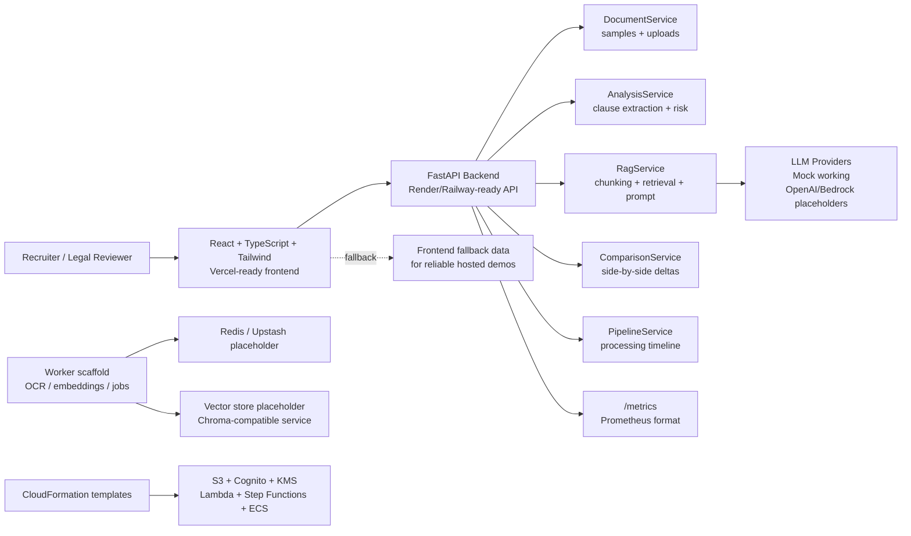

# LegalDocs AI


**LegalDocs AI is a demo-ready contract intelligence platform that analyzes agreements, extracts risky clauses, answers questions with mock RAG, and demonstrates production-style cloud architecture.**

This repository is built for software engineering and AI engineering recruiters. It is not represented as a production legal product. It is a polished prototype with local mock services, realistic sample data, production-style service boundaries, Docker, Kubernetes manifests, CI/CD, monitoring, and cloud infrastructure templates.

## Product Demo

The demo behaves like a small contract review SaaS product:

- Select or upload a `.txt` contract.
- View document stats and processing status.
- Generate a contract summary and clause-level risk analysis.
- Ask questions about the selected contract.
- Compare two contracts side by side.
- Inspect a processing pipeline from upload through summarization.

The LLM and vector store layers are intentionally simulated by default so the project runs reliably without paid APIs or external infrastructure. OpenAI and Bedrock provider placeholders are included for extension.

## Why This Exists

Recruiters often review projects quickly. This project is designed so the repository itself communicates engineering maturity even before someone runs it:

- clear product concept,
- working frontend and backend,
- typed API contracts,
- service-layer backend organization,
- demo-safe AI/RAG abstraction,
- cloud-ready infrastructure scaffolding,
- credible observability and deployment artifacts.

## Key Features

- Recruiter-facing landing page and SaaS dashboard.
- Drag-and-drop document upload card.
- Realistic sample contracts and deterministic sample outputs.
- Clause extraction for termination, payment, confidentiality, liability, governing law, and renewal.
- Low, medium, and high risk scoring with recommendations.
- Ask-your-contract chat powered by mock retrieval and prompt construction.
- Contract comparison with side-by-side differences.
- Processing timeline: Uploaded -> OCR Extracted -> Chunked -> Embedded -> Retrieved -> Summarized -> Completed.
- Frontend fallback mode so hosted demos keep working if the backend is asleep or unavailable.
- Health and metrics endpoints for Render/Railway and Prometheus.

## Architecture Overview

The frontend is a Vite React app designed for Vercel. The backend is a FastAPI service designed for Render, Railway, or container hosting. Local demo mode uses in-memory sample documents, deterministic analysis, and mock RAG retrieval. Production-style templates model Redis/worker queues, a vector store, AWS storage, identity, workflow orchestration, and container compute.

## Architecture Diagram



## Tech Stack

| Layer | Technology | Purpose |
| --- | --- | --- |
| Frontend | React, TypeScript, Vite, Tailwind CSS | Polished recruiter-facing SaaS demo |
| Backend | FastAPI, Pydantic | Typed API, request validation, service-layer architecture |
| AI/RAG | Mock provider, retrieval service, provider abstraction | Reliable local demo with OpenAI/Bedrock extension points |
| Data | In-memory sample store | Zero-setup demo data and uploads |
| DevOps | Docker, Docker Compose, Makefile | Local development and containerized demo |
| Kubernetes | Deployments, services, ingress, HPA, configmap, secret examples | Credible orchestration scaffolding |
| Observability | Prometheus, Grafana dashboard JSON | Metrics endpoint and monitoring setup |
| Cloud | CloudFormation | AWS-style S3, Cognito, KMS, Lambda, Step Functions, ECS templates |
| CI/CD | GitHub Actions | Install, lint, test, build, Docker validation |

## Local Setup

```bash
git clone https://github.com/sathwin/legaldocs-ai.git
cd legaldocs-ai
make install
```

Run backend:

```bash
make backend
```

Run frontend:

```bash
make frontend
```

Open:

- Frontend: `http://localhost:5173`
- Backend docs: `http://localhost:8000/docs`
- Health check: `http://localhost:8000/health`
- Metrics: `http://localhost:8000/metrics`

## Docker Compose Setup

```bash
docker compose up --build
```

Services:

| Service | URL | Notes |
| --- | --- | --- |
| Frontend | `http://localhost:3000` | Nginx serving built React app |
| Backend | `http://localhost:8000` | FastAPI API |
| Prometheus | `http://localhost:9090` | Scrapes backend `/metrics` |
| Grafana | `http://localhost:3001` | Login `admin/admin` |
| Redis | `localhost:6379` | Placeholder for worker queue |
| Worker | container only | Demo worker scaffold |

## Hosted Demo

Recommended hosting split:

- Frontend: Vercel
- Backend: Render or Railway
- Redis: Upstash if needed, otherwise demo mode remains mock-backed

Frontend environment variable:

```bash
VITE_API_BASE_URL=https://your-render-or-railway-api.onrender.com
VITE_ENABLE_DEMO_FALLBACK=true
```

Backend environment variables:

```bash
LEGALDOCS_DEMO_MODE=true
LEGALDOCS_LLM_PROVIDER=mock
LEGALDOCS_CORS_ORIGINS=https://your-vercel-app.vercel.app,http://localhost:5173,http://localhost:3000
```

If the backend is unavailable, the frontend displays realistic fallback demo data rather than crashing. This keeps recruiter demos reliable while still showing the intended workflow.

## Kubernetes Deployment Overview

The `k8s/` folder includes:

| Manifest | Purpose |
| --- | --- |
| `namespace.yaml` | Isolates project resources |
| `configmap.yaml` | Non-secret runtime configuration |
| `secret.example.yaml` | Example LLM/API secrets |
| `frontend-deployment.yaml` / `frontend-service.yaml` | Web app deployment |
| `backend-deployment.yaml` / `backend-service.yaml` | FastAPI deployment |
| `worker-deployment.yaml` / `worker-service.yaml` | Background job scaffold |
| `redis-deployment.yaml` / `redis-service.yaml` | Queue/cache placeholder |
| `vector-store.yaml` | Chroma-compatible vector store placeholder |
| `ingress.yaml` | Public routing scaffold |
| `hpa.yaml` | Autoscaling examples |

Example:

```bash
kubectl apply -f k8s/namespace.yaml
kubectl apply -f k8s/configmap.yaml
kubectl apply -f k8s/secret.example.yaml
kubectl apply -f k8s/
```

Update image names before deploying to a real cluster.

## API Endpoints

| Method | Endpoint | Description |
| --- | --- | --- |
| GET | `/health` | Render/Railway health check |
| GET | `/metrics` | Prometheus metrics |
| GET | `/api/dashboard/stats` | Dashboard summary stats |
| GET | `/api/documents` | List sample and uploaded documents |
| GET | `/api/documents/{document_id}` | Get document text and metadata |
| POST | `/api/documents/upload` | Upload `.txt` contract |
| POST | `/api/contracts/analyze` | Analyze clauses and risk |
| POST | `/api/contracts/compare` | Compare two contracts |
| POST | `/api/chat/query` | Ask a question using mock RAG |
| GET | `/api/pipeline/{job_id}` | Processing timeline status |

## Monitoring and Observability

- FastAPI exposes `/metrics` using `prometheus-client`.
- Docker Compose starts Prometheus and Grafana.
- `monitoring/prometheus.yml` scrapes the backend service.
- `monitoring/grafana-dashboard.json` includes request rate, p95 latency, and 5xx panels.
- Health checks are configured in Docker Compose and suitable for Render/Railway.

## CI/CD

GitHub Actions workflow:

1. Installs backend dependencies.
2. Runs backend tests.
3. Runs backend compile/lint check.
4. Installs frontend dependencies.
5. Runs frontend lint/typecheck.
6. Builds the frontend.
7. Validates Docker Compose config.
8. Builds Docker images.

Workflow file: `.github/workflows/ci.yml`

## Cloud Deployment

CloudFormation templates in `infra/cloudformation/` model a credible AWS deployment:

- S3 for contract storage,
- KMS for encryption,
- Cognito for identity and RBAC,
- SQS for ingestion queues,
- Lambda for event handling,
- Step Functions for document processing orchestration,
- ECS for API and worker containers.

These templates are intentionally scaffolded and should be hardened before production use.

## Screenshots

Placeholder paths for README images:


## Engineering Highlights

- Service-layer backend architecture with `DocumentService`, `AnalysisService`, `RagService`, `ComparisonService`, and `PipelineService`.
- LLM provider abstraction with mock implementation and OpenAI/Bedrock placeholders.
- Typed Pydantic request/response models.
- TypeScript API client and shared frontend response types.
- Frontend fallback mode for reliable hosted demos.
- Docker, Kubernetes, CI/CD, monitoring, and cloud templates included.
- Honest production-style design without overclaiming real production readiness.

## Known Limitations

- The default LLM provider is a deterministic mock.
- Vector storage and Redis are scaffolded, not required for local demo mode.
- Uploaded documents are stored in memory and reset when the backend restarts.
- PDF OCR is documented as a worker extension, but `.txt` is the supported local upload path.
- Kubernetes and CloudFormation are credible scaffolds, not hardened production deployments.

## Future Improvements

- Add persistent storage with Postgres or DynamoDB.
- Add S3-backed document uploads.
- Implement real OpenAI, Azure OpenAI, Bedrock, or OpenRouter providers.
- Add embeddings with Chroma, FAISS, OpenSearch, or pgvector.
- Add JWT auth with Cognito and tenant-scoped authorization.
- Add Playwright end-to-end tests and screenshot automation.
- Add structured audit logs and reviewer export reports.
